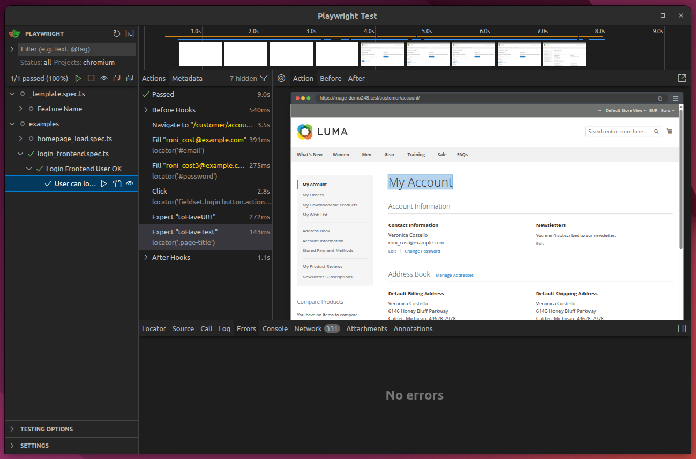

# Playwright ETE Test Suite Base

This directory contains the base configuration and template files to set up an End-to-End (ETE) testing suite using Playwright for Magento 2 projects.

## Installation & Usage / Instalación y Uso / Instal·lació i Ús

Please refer to the instructions file in your preferred language:
Por favor, consulte el archivo de instrucciones en su idioma preferido:
Si us plau, consulteu el fitxer d'instruccions en el vostre idioma preferit:

*   **English**: [INSTRUCTIONS_EN.md](INSTRUCTIONS_EN.md)
*   **Español**: [INSTRUCTIONS_ES.md](INSTRUCTIONS_ES.md)
*   **Català**: [INSTRUCTIONS_CA.md](INSTRUCTIONS_CA.md)
